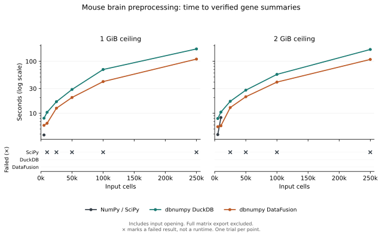

# Preprocessing from database files

This experiment uses the [same NumPy-style function](pbmc-benchmark.md) on a
larger dataset. DuckDB opens an existing table, DataFusion scans coordinate
Parquet, and SciPy loads a sparse array. The function contains no SQL or
backend-specific calculations.

This compares an ordinary eager SciPy workflow with dbnumpy's database
execution. It does not test a separate blockwise SciPy implementation or time
Scanpy itself. The database file formats differ, so the results compare these
complete input paths as well as their execution engines.

A [follow-up using full WSL RAM](brain-max-ram.md) repeats the same sizes
with a 7.51 GiB worker ceiling.

## Pilot results

One trial per configuration in WSL 2, Python 3.14.7, on an Intel(R) Core(TM) Ultra 5 125U. These are exploratory timings. 9 of 36 trials completed and verified the full output. 27 produced verified selections, counts, means and variances.

### Full workflow, including sparse matrix collection

| RAM | Cells | NumPy / SciPy | dbnumpy DuckDB | dbnumpy DataFusion |
|---|---:|---:|---:|---:|
| 1 GiB | 5,000 | 3.90 s | 9.31 s | 7.09 s |
| 1 GiB | 10,000 | RAM limit | RAM limit | RAM limit |
| 1 GiB | 25,000 | RAM limit | RAM limit | RAM limit |
| 1 GiB | 50,000 | RAM limit | RAM limit | RAM limit |
| 1 GiB | 100,000 | RAM limit | RAM limit | RAM limit |
| 1 GiB | 250,000 | RAM limit | RAM limit | RAM limit |
| 2 GiB | 5,000 | 3.97 s | 9.49 s | 6.89 s |
| 2 GiB | 10,000 | 8.50 s | 13.62 s | 8.10 s |
| 2 GiB | 25,000 | RAM limit | RAM limit | RAM limit |
| 2 GiB | 50,000 | RAM limit | RAM limit | RAM limit |
| 2 GiB | 100,000 | RAM limit | RAM limit | RAM limit |
| 2 GiB | 250,000 | RAM limit | RAM limit | RAM limit |

A numerical time means the full sparse output passed verification. A resource failure is not assigned a runtime.

### Through verified gene summaries



| RAM | Cells | NumPy / SciPy | dbnumpy DuckDB | dbnumpy DataFusion |
|---|---:|---:|---:|---:|
| 1 GiB | 5,000 | 3.83 s | 8.05 s | 5.87 s |
| 1 GiB | 10,000 | Not completed | 10.46 s | 6.44 s |
| 1 GiB | 25,000 | Not completed | 16.74 s | 12.55 s |
| 1 GiB | 50,000 | Not completed | 28.75 s | 20.17 s |
| 1 GiB | 100,000 | Not completed | 69.66 s | 40.79 s |
| 1 GiB | 250,000 | Not completed | 173.25 s | 110.46 s |
| 2 GiB | 5,000 | 3.90 s | 7.95 s | 5.53 s |
| 2 GiB | 10,000 | 8.31 s | 10.55 s | 5.75 s |
| 2 GiB | 25,000 | Not completed | 17.02 s | 12.92 s |
| 2 GiB | 50,000 | Not completed | 27.89 s | 20.82 s |
| 2 GiB | 100,000 | Not completed | 56.12 s | 39.88 s |
| 2 GiB | 250,000 | Not completed | 169.28 s | 108.84 s |

These times include opening the input and the shared preprocessing function. They exclude full matrix export. A verified summary does not establish that the entire transformed matrix can be collected under the same limit.

[Measurements, failures and source hashes](../assets/brain-preprocessing-results.json)

### What this shows

Both databases calculated correct summaries for 250,000 cells under either
ceiling. The shared SciPy workflow completed through 5,000 cells at 1 GiB and
10,000 cells at 2 GiB. All larger SciPy trials ran out of memory before producing
summaries. This supports using dbnumpy for calculations that read large files
and return small results. It does not establish a general speed advantage or
compare with a blockwise SciPy implementation.

Full matrix collection is still a limitation. All three implementations
completed the same tested sizes: 5,000 cells at 1 GiB, and 5,000 and 10,000 cells
at 2 GiB. Every larger database trial failed during sparse collection, after
producing correct summaries. Keeping a calculation in the database helps;
collecting its entire result still needs enough host memory.

No numerical check failed. Across verified results, the largest absolute
differences were `2.27e-13` for gene means, `1.48e-12` for gene variances and
`1.78e-15` for exported matrix values. The large matrices that could not be
exported were not checked value by value. All 27 resource failures were
confirmed Linux memory-limit kills; none was a timeout or disk-space stop.

### One-time file preparation

| Step | Seconds |
|---|---:|
| Read HDF5 and write selected CSR arrays | 442.15 |
| Sort entries and check for duplicates | 310.70 |
| Write and hash Parquet | 136.02 |
| Create DuckDB table | 198.46 |
| Total, including final input hashes | 1147.35 |

Download and independent reference calculations are excluded from those figures.

## Data

The source is 10x Genomics'
[1.3 Million Brain Cells from E18 Mice](https://www.10xgenomics.com/datasets/1-3-million-brain-cells-from-e-18-mice-2-standard-1-3-0),
licensed under [CC BY 4.0](https://creativecommons.org/licenses/by/4.0/).
It contains 1,306,127 cells from two mice. The
[filtered HDF5 file](https://s3-us-west-2.amazonaws.com/10x.files/samples/cell/1M_neurons/1M_neurons_filtered_gene_bc_matrices_h5.h5)
is 4,216,018,749 bytes.

The sizes are 5,000, 10,000, 25,000, 50,000, 100,000 and 250,000 actual cells, sampled
without replacement with seed `20260916`. Samples are nested and start with
all genes. Original cell indices, input hashes and nonzero counts are saved.
The largest input has 502,051,514 stored counts across 27,998 genes. Its
float64 values and int32 column indices alone occupy about 5.61 GiB. The
benchmark uses 250,000 cells from the source; it does not run all 1.3 million.

## Preparation and timing

Preparation reads the HDF5 file in small blocks and sorts entries within each
cell. It checks that sorting does not merge duplicate entries or change counts.
It writes CSR arrays for SciPy,
coordinate Parquet for DataFusion, and a DuckDB table loaded through DuckDB's
public relation API. Coordinates must be unique and in bounds, and stored
counts must be finite and positive. No custom SQL is used in preparation or
the scientific workflow.

Preparation is measured separately and excluded from trial runtime. Database
workers do not build a SciPy input. SciPy loads only the requested prefix of
the prepared CSR arrays and owns its buffers, without an extra input copy.
The three inputs contain the same float64 values in the same cell/gene order.

Each trial records three stages:

| Stage | Work included |
|---|---|
| Open input | Load the SciPy arrays, or connect and wrap database files |
| Preprocess | Cell/gene filters, normalization, log1p, means and sample variance |
| Collect | Produce the full transformed SciPy sparse array |

The total is the sum of these stages. Initial imports, saving results,
verification and connection cleanup are excluded. Database reductions execute
during preprocessing; collection executes any remaining lazy calculation.

## Memory limits

Each worker has a hard Linux cgroup memory ceiling of 1 GiB or 2 GiB and no
swap. Each database gets an internal execution budget equal to half that
ceiling. NumPy's thread libraries and DuckDB use one thread; DataFusion uses
one partition. Trials run serially in fresh processes with a ten-minute
deadline. Before each worker, `POSIX_FADV_DONTNEED` requests eviction of its
input files from Linux's cache, so preparation does not intentionally leave
those pages charged outside the worker's cgroup. This is an advisory request;
Windows' host cache is not controlled. These are not cold-disk tests.
SciPy workers do not import dbnumpy or either database engine. Each worker uses
a dedicated spill directory. A run stops if free disk space falls below 5 GiB;
that outcome is recorded separately from a memory failure.

The sparse collection limit is explicitly raised to two billion entries for
this experiment; the default guard against dense expansion remains enabled.
The operating-system memory cap still applies throughout each worker's life.
The cap applies to the worker, not the whole WSL virtual machine.

The full-RAM follow-up uses `--limits max`, which sets the worker ceiling to
Linux's reported physical RAM. Linux and other WSL processes share that RAM,
so less than the full amount is available to Python. Swap remains disabled
for the worker. At this ceiling, the worker is preferred for an out-of-memory
kill over unrelated processes. The database execution budget remains half
the worker ceiling.

## Correctness checks

An independent reference is calculated in small blocks outside timed workers.
Scanpy supplies cell filtering and gene detection counts. Gene counts are
combined across blocks before applying the global gene filter. Each retained
block is normalized and log-transformed with Scanpy. Gene variances use
centered differences, including implicit zeros, rather than the second-moment
formula in the shared workflow.

Small fixture tests also compare this reference with a separate dense NumPy
calculation, check both database file readers, and deliberately corrupt an
output value to confirm that verification rejects it.

Completed trials check every output value and coordinate in blocks, plus exact
cell/gene selections and count summaries. Floating-point comparisons use
`rtol=1e-9`, `atol=1e-11`. This checks the whole output, not a sample.

Small summaries are saved before full collection. If collection fails, those
summaries can still be verified and reported separately. That does not make
the full workflow a pass. A memory failure or timeout has no successful total
runtime.

## Reproduce

Use the optional dependencies in `benchmarks/requirements-pbmc.txt`. Download
the HDF5 file above, then run from a checkout in Linux or WSL 2:

```bash
python benchmarks/brain_preprocessing.py prepare \
  --archive /path/to/1M_neurons.h5 --data benchmark-results/brain/prepared

for size in 5000 10000 25000 50000 100000 250000; do
  python benchmarks/brain_preprocessing.py reference \
    --data benchmark-results/brain/prepared --size "$size"
done

sudo /absolute/path/to/venv/bin/python benchmarks/brain_preprocessing.py run \
  --data benchmark-results/brain/prepared \
  --output benchmark-results/brain/runs \
  --limits 1 2 --sizes 5000 10000 25000 50000 100000 250000 --repeats 1 \
  --uid "$(id -u)" --gid "$(id -g)"

python benchmarks/plot_brain_preprocessing.py \
  --results benchmark-results/brain/runs/results.json \
  --output benchmark-results/brain/summaries
```

The supervisor creates temporary cgroups; workers run as the supplied non-root
user. System-wide memory and swap settings are unchanged. Use new preparation
and run directories. The worker needs access to the prepared files, including
write access to the DuckDB database for its view and temporary metadata.

To repeat with all physical RAM reported by Linux, use a separate run directory:

```bash
sudo /absolute/path/to/venv/bin/python benchmarks/brain_preprocessing.py run \
  --data benchmark-results/brain/prepared \
  --output benchmark-results/brain/max-ram --limits max --repeats 1 \
  --uid "$(id -u)" --gid "$(id -g)"

for metric in summaries full; do
  python benchmarks/plot_brain_preprocessing.py \
    --results benchmark-results/brain/max-ram/results.json \
    --output "benchmark-results/brain/max-ram-$metric" --metric "$metric"
done
```

Plots place failed results in a separate strip marked with an **×**. Their
positions in that strip do not represent runtimes.

If preparation stops after writing the CSR arrays and `dataset.json`, the
`prepare-stores` command resumes sorting and file creation without rereading
the HDF5 source. It refuses to overwrite an existing DuckDB database.
