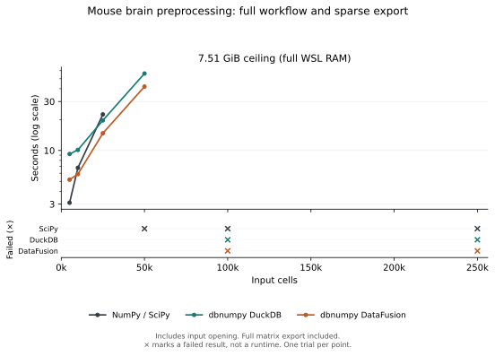
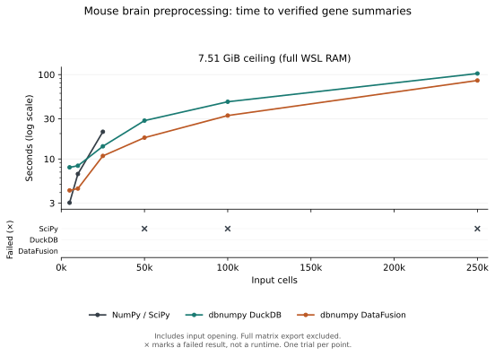

# Larger dataset with full WSL RAM

WSL 2 reported **7.51 GiB of physical RAM** (8,064,274,432 bytes). The worker ceiling was set to that full value, with swap disabled. Linux and other WSL processes share this RAM, so it is not all available to Python. At this ceiling, the benchmark worker is preferred for an out-of-memory kill over unrelated processes.

The dataset, six nested samples, shared NumPy-style function, package code and independent references are unchanged from the 1–2 GiB pilot. The database execution budget remains half the worker ceiling. No handwritten SQL or alternative scientific calculation was added. One trial per configuration; preparation and validation are outside the timings. Each worker retains the 600-second deadline, including imports and result saving. The reported successful runtime excludes imports and result saving.

All 18 configurations were recorded. **11 full outputs and 15 sets of summaries passed verification.**

## What changed with more RAM

- **NumPy / SciPy:** largest completed full output was 25,000 cells; largest verified summary was 25,000 cells.
- **dbnumpy DuckDB:** largest completed full output was 50,000 cells; largest verified summary was 250,000 cells.
- **dbnumpy DataFusion:** largest completed full output was 50,000 cells; largest verified summary was 250,000 cells.

These are the largest successful sizes tested, not exact capacity limits. Single trials are useful for identifying failures but do not establish stable speed differences. This compares the shared eager SciPy workflow with dbnumpy; it does not test a separate blockwise SciPy implementation.

## Full workflow and sparse matrix export

| Cells | NumPy / SciPy | dbnumpy DuckDB | dbnumpy DataFusion |
|---:|---:|---:|---:|
| 5,000 | 3.10 s | 9.23 s | 5.20 s |
| 10,000 | 6.77 s | 10.13 s | 5.89 s |
| 25,000 | 22.47 s | 19.65 s | 14.72 s |
| 50,000 | × RAM limit | 56.22 s | 41.91 s |
| 100,000 | × RAM limit | × RAM limit | × RAM limit |
| 250,000 | × RAM limit | × Time limit | × RAM limit |

## Through verified gene summaries

| Cells | NumPy / SciPy | dbnumpy DuckDB | dbnumpy DataFusion |
|---:|---:|---:|---:|
| 5,000 | 3.03 s | 7.96 s | 4.24 s |
| 10,000 | 6.65 s | 8.32 s | 4.46 s |
| 25,000 | 21.03 s | 14.13 s | 10.88 s |
| 50,000 | × RAM limit | 28.50 s | 17.90 s |
| 100,000 | × RAM limit | 47.66 s | 32.72 s |
| 250,000 | × RAM limit | 103.00 s | 85.17 s |

The summary timings include input opening and preprocessing but exclude full matrix export. A checked summary is not proof that the full matrix can be collected within the same memory budget.

An **×** denotes a failed result. Crosses sit in a separate failure strip because an unsuccessful run has no completion runtime. Curves contain only verified results.

[Full method and original 1–2 GiB results](brain-benchmark.md) · [Raw measurements and source hashes](../assets/brain-max-ram-results.json)
