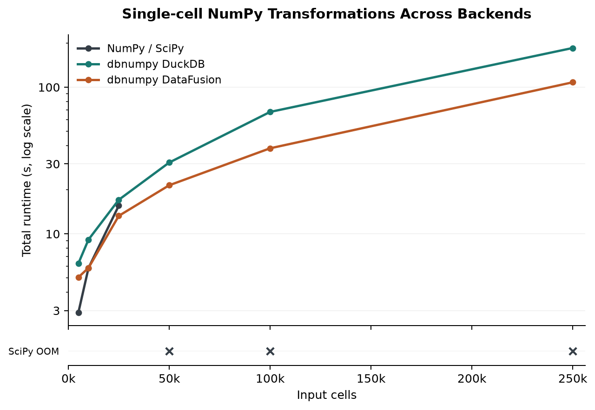
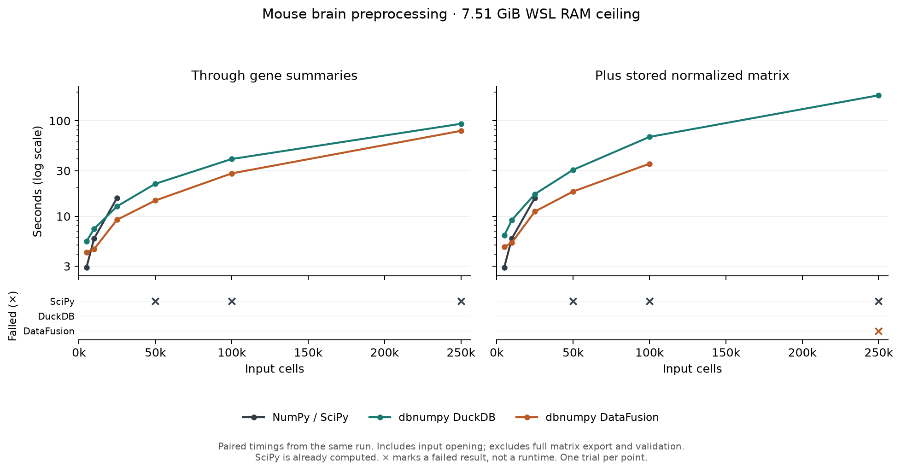

# Computing and storing the normalized matrix

The summary benchmark already computes the filtering, normalization and gene statistics. This follow-up adds `result.values.compute()` after the same workflow. It stores the complete normalized matrix inside the database, without exporting that matrix to Python.



## Updated DataFusion results

DataFusion now stores computed matrices in temporary Parquet files. It completed
250,000 input cells in 107.97 seconds, including 25.54 seconds for `compute()`.
The scientific function, inputs, dependency versions and reference data are
unchanged. All six rerun points passed the summary, entry-count and sampled-value
checks described below.

| Input cells | Through summaries (s) | Added compute (s) | Total (s) |
|---:|---:|---:|---:|
| 5,000 | 4.30 | 0.76 | 5.06 |
| 10,000 | 4.87 | 1.00 | 5.87 |
| 25,000 | 10.26 | 3.00 | 13.27 |
| 50,000 | 16.82 | 4.62 | 21.45 |
| 100,000 | 29.15 | 9.17 | 38.32 |
| 250,000 | 82.43 | 25.54 | 107.97 |

The figure uses all six Parquet-backed DataFusion measurements and the earlier
NumPy/SciPy and DuckDB measurements. The 10,000, 25,000 and 50,000-cell cases
were added in a second run with the same scientific code, package source,
dependency versions, data and validation checks. No cache-based DataFusion
measurements are mixed into the updated line.

The rerun used Linux temporary storage. Large writes to the Windows-mounted
directory failed with `Upload aborted`; the same writer succeeded on Linux.
The earlier runs used Windows-mounted temporary storage. This difference and
the single trial per point prevent a controlled comparison of relative speed.

The [combined result record](../assets/brain-datafusion-disk-results.json) identifies
the source run for every point. The [initial three points](../assets/brain-datafusion-initial-results.json)
were recovered from captured supervisor output after their temporary directory
disappeared; their original validation files are not retained. The
[three added points](../assets/brain-datafusion-missing-results.json) come from the
original result JSON, with their logs and validation files archived locally
before the WSL session ended.

## Original results: in-memory DataFusion cache

These results describe the previous implementation and are retained for comparison.



One trial per engine and size, with a 7.510 GiB WSL RAM ceiling. 14 of 18 trials completed the stored-matrix endpoint and its checks. 15 trials produced verified workflow summaries.

At 100,000 cells, compute added 28.02 seconds for DuckDB (70.4%) and 7.39 seconds for DataFusion (26.3%). DuckDB also completed 250,000 cells in 185.01 seconds including compute. DataFusion ran out of memory while caching that largest result. SciPy ran out of memory during the workflow at 50,000 cells and above.

Both columns come from the same process. The added time is measured around `compute()` itself; it is not the difference between separate benchmark runs. SciPy's matrix is already computed, so its added time is zero.

| Input cells | Engine | Through summaries (s) | Added compute (s) | Added time (%) | Total (s) |
|---:|---|---:|---:|---:|---:|
| 5,000 | NumPy / SciPy | 2.92 | 0.00 | 0.0% | 2.92 |
| 5,000 | DuckDB | 5.47 | 0.83 | 15.2% | 6.30 |
| 5,000 | DataFusion | 4.20 | 0.59 | 14.0% | 4.79 |
| 10,000 | NumPy / SciPy | 5.86 | 0.00 | 0.0% | 5.86 |
| 10,000 | DuckDB | 7.39 | 1.75 | 23.7% | 9.14 |
| 10,000 | DataFusion | 4.54 | 0.77 | 16.9% | 5.30 |
| 25,000 | NumPy / SciPy | 15.58 | 0.00 | 0.0% | 15.58 |
| 25,000 | DuckDB | 12.71 | 4.36 | 34.3% | 17.07 |
| 25,000 | DataFusion | 9.20 | 2.01 | 21.9% | 11.21 |
| 50,000 | NumPy / SciPy | × | × | — | × |
| 50,000 | DuckDB | 21.88 | 8.76 | 40.1% | 30.64 |
| 50,000 | DataFusion | 14.62 | 3.54 | 24.2% | 18.16 |
| 100,000 | NumPy / SciPy | × | × | — | × |
| 100,000 | DuckDB | 39.80 | 28.02 | 70.4% | 67.82 |
| 100,000 | DataFusion | 28.13 | 7.39 | 26.3% | 35.52 |
| 250,000 | NumPy / SciPy | × | × | — | × |
| 250,000 | DuckDB | 93.08 | 91.93 | 98.8% | 185.01 |
| 250,000 | DataFusion | 78.47 | × | — | × |

× means the endpoint did not complete and pass validation. It is not a measured runtime.

| Failed trial | Failure | Last stage | Stored-matrix endpoint reached? |
|---|---|---|---|
| NumPy / SciPy, 50,000 cells | memory_limit | workflow | No |
| NumPy / SciPy, 100,000 cells | memory_limit | workflow | No |
| NumPy / SciPy, 250,000 cells | memory_limit | workflow | No |
| DataFusion, 250,000 cells | memory_limit | native_compute | No |

## What the extra step does

- DuckDB executes the matrix expression into a temporary table. Its buffer manager can spill to the configured temporary directory.
- The original DataFusion run used `cache()` to retain an in-memory table. The updated implementation streams the result to temporary Parquet files and registers a scan of those files. The backend removes its result files when it closes.
- SciPy retains its existing sparse result. No artificial copy or extra calculation is added.

The database paths evaluate the normalization expression again to store it. The earlier reductions return gene summaries, but do not retain the whole normalized matrix. These timings measure the current API sequence, including that repeated work. Computing before the final reductions might give a different total; that is a separate experiment.

## Correctness checks

Validation runs after the timer. Workflow cell/gene selections and count vectors are compared exactly with the independent reference. Means and sample variances are checked with `rtol=1e-9`, `atol=1e-11`.

After materialization, all gene means and variances are calculated again from the stored matrix. Its positive entry count is checked against the reference. All stored input counts are positive and normalization preserves positivity. Sixty-four complete rows, spread across the result, are then collected and checked coordinate by coordinate against independent Scanpy normalization. This bounded sample is outside the timer.

The largest absolute error in sampled normalized values was 8.88e-16. The large runs do not compare every matrix entry. A separate small fixture does compare every entry for all three engines, including zero cells, a rare gene and unsorted source coordinates. The test also confirms that the verifier rejects an intentionally altered value.

## Conditions and limits

- Same nested samples of actual cells from the 10x 1.3M mouse brain dataset: 5,000 through 250,000 input cells. The entire 1.3M-cell matrix was not benchmarked.
- The scientific function, package source, prepared dataset and independent references match the previous full-RAM study. No handwritten scientific SQL was added.
- Input opening is timed. Downloading, preparing input formats, imports and correctness checks are excluded. The full matrix is never exported during this benchmark.
- Workers run serially in fresh processes. Each cgroup has the full WSL RAM ceiling and no swap; database memory budgets are half that ceiling. WSL itself has overhead, so Linux can kill a worker before it reaches its cgroup ceiling.
- BLAS/OpenMP thread settings, DuckDB threads and DataFusion target partitions are set to one. This does not establish identical CPU use across engines; CPU affinity was not imposed.
- Each worker has a 600-second wall deadline, including imports and the post-compute checks. The external reference comparison runs separately.
- Linux input-cache eviction is requested before each trial; the Windows host cache is uncontrolled. The engines read different prepared formats.
- This is an ordinary eager NumPy/SciPy baseline, not an optimized in-place or blockwise implementation. One trial per point cannot establish stable speedups.
- An initial pilot was stopped after the validator's COO row selection was found to allocate an unnecessarily large temporary. Sampling was corrected outside the timed section, the fixture was rerun, and all 18 reported trials were restarted with the corrected runner. The interrupted pilot is excluded.

## Reproduce

To regenerate the updated figure from the recorded measurements:

```sh
python benchmarks/plot_brain_compute.py \
  --results docs/assets/brain-native-compute-results.json \
  --datafusion-results docs/assets/brain-datafusion-disk-results.json \
  --output docs/assets/brain-native-compute
```

The command below runs a new benchmark with the current implementation. For WSL,
use Linux storage for the run directory, and archive the results to a persistent
location before the WSL session ends. The worker places temporary data under the
run directory. Omit `--engines` to run all engines, or use `--engines datafusion`
for a focused rerun.

Use the prepared inputs and references from the [disk-backed benchmark](brain-benchmark.md). Inside WSL, run the supervisor as root with non-root worker uid/gid:

```sh
python benchmarks/brain_preprocessing.py run \
  --data /path/to/brain-prepared --output /path/to/new-compute-runs \
  --endpoint native --limits max --repeats 1 --timeout 600
python benchmarks/plot_brain_compute.py \
  --results /path/to/new-compute-runs/results.json \
  --output docs/assets/brain-native-compute
```

[Raw results and source hashes](../assets/brain-native-compute-results.json). The previous [full-RAM export study](brain-max-ram.md) remains a separate benchmark.
The measured runner called SciPy's eager storage `eager_csr`; the returned normalized array is COO. That descriptive field is corrected in the published JSON with a correction record. Timings and outcomes are unchanged. The [original measurement file](../assets/brain-native-compute-measured-results.json) is also retained.
