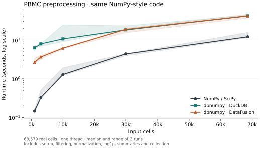

# PBMC preprocessing

This example runs one NumPy-style function with three inputs: a SciPy sparse
array, a dbnumpy DuckDB array and a dbnumpy DataFusion array. The function uses
ordinary NumPy calls, arithmetic and indexing. It contains no SQL or backend
branches.

## Results



Median runtime across three runs; shaded bands show the minimum and maximum.
All 45 trials passed, including all three full-size DataFusion runs. Every
completed trial checks the full sparse output, selections and gene summaries.

| Input cells | NumPy / SciPy | dbnumpy DuckDB | dbnumpy DataFusion |
|---:|---:|---:|---:|
| 1,000 | 0.15 s | 6.29 s | 2.65 s |
| 3,000 | 0.33 s | 7.97 s | 3.66 s |
| 10,000 | 1.29 s | 10.70 s | 6.18 s |
| 30,000 | 4.41 s | 18.28 s | 18.86 s |
| 68,579 | 12.14 s | 41.98 s | 41.67 s |

NumPy/SciPy was faster in every comparison. Loading an in-memory sparse matrix
into a database adds work. These results describe this preprocessing workflow;
they do not establish performance on data already stored in a database or
general Scanpy compatibility.

[Individual timings, checksums and environment](../assets/pbmc-preprocessing-results.json)
are saved with the figure.

A separate [memory-limit pilot](pbmc-memory-pressure.md) tests this workflow
under hard 1 GiB and 2 GiB ceilings.

## Workflow

| Step | Operation |
|---|---|
| Cell summaries | Total counts and number of detected genes |
| Cell filter | Keep cells with at least 200 detected genes |
| Gene filter | Keep genes detected in at least 3 retained cells |
| Empty cells | Remove any cells left with zero total counts |
| Normalization | Scale each cell to 10,000 total counts |
| Transformation | Apply `np.log1p` |
| Gene summaries | Mean and sample variance of the transformed values |

These are common preprocessing steps, not a complete biological analysis.
The example does not select highly variable genes, run PCA or cluster cells.
The shared function is independently checked against Scanpy's
`filter_cells`, `filter_genes`, `normalize_total` and `log1p` functions.
The timed host implementation is NumPy/SciPy, not Scanpy itself.

```python
from scipy import sparse
import dbnumpy as dnp
from examples.pbmc_workflow import preprocess

# Use a subset produced by the preparation command below.
counts = sparse.csr_array(sparse.load_npz(
    "benchmark-results/pbmc/prepared/input-1000.npz"
))
reference = preprocess(counts)

with dnp.DuckDBBackend.connect() as backend:
    result = preprocess(backend.from_scipy(counts))
    transformed = result.values.to_scipy()

# Use DataFusionBackend above to run exactly the same function in DataFusion.
```

Use a sparse **array** (`csr_array`), since its `*` operator means elementwise
multiplication. SciPy's older `csr_matrix` uses `*` for matrix multiplication.
The returned cell and gene indices preserve the link to the original metadata.
Cell counts describe the original input; gene summaries describe the filtered,
transformed output. The workflow expects finite, nonnegative counts and rejects
results with no genes or fewer than two cells.

## Data

The input is 10x Genomics'
[Fresh 68k PBMCs, Donor A](https://www.10xgenomics.com/datasets/fresh-68-k-pbm-cs-donor-a-1-standard-1-1-0),
licensed under [CC BY 4.0](https://creativecommons.org/licenses/by/4.0/).
It contains 68,579 cells, 32,738 genes and 37,323,295 nonzero counts.

The five subsets contain 1,000, 3,000, 10,000, 30,000 and 68,579 actual cells.
They are nested samples without replacement, with seed `20260915`. Each starts
with all 32,738 genes. Filtering changes the number of retained genes as the
sample grows. The saved results record those counts and input checksums.

## Timing and checks

Measurements were made in WSL 2 on an Intel Core Ultra 5 125U, with Python
3.14.7, NumPy 2.5.3, SciPy 1.18.1, DuckDB 1.5.5 and DataFusion 54.0.0.

Each trial starts with the same prepared float64 sparse input in memory. Its
timer covers making a working copy or setting up the database and loading the
input, running the shared function, and collecting the final sparse result.
Database reductions execute during the function; final collection executes
the remaining lazy expression. The NumPy curve includes the same calculations.

Download, file parsing, subset preparation, initial package imports, output
checks and connection cleanup are outside the timer. Any initialization during
first use is included. This measures a fresh session, not an already loaded
database or a warmed query cache. It is an in-memory input comparison, not a
test of datasets larger than RAM.

Trials run serially in fresh processes, with three repeats and a rotating engine
order. NumPy's thread libraries use one thread, DuckDB uses one thread and
DataFusion uses one partition. Database execution budgets are 2 GB for DuckDB
and 2 GiB for DataFusion. The sparse collection limit is 100 million entries;
the default protection against dense expansion remains enabled. Each process
has a 300-second deadline and a 5.5 GiB resident-memory stop.

Every completed trial checks the full sparse output, cell and gene selections,
cell counts against the shared NumPy/SciPy reference. Gene means and sample
variances are compared directly with independent statistics from Scanpy output.
Those statistics use dense column blocks and NumPy's centered variance calculation. Integer counts and selections must match exactly. Floating-point
values use `rtol=1e-9` and `atol=1e-11`. Separate small tests compare sample
variance with NumPy's `var(ddof=1)` and cover empty cells and filtering failures.
Scanpy output is also checked at every dataset size, outside the timings.

## Reproduce

Run from a repository checkout in Linux or WSL 2. Install dbnumpy's two backend
extras and SciPy, then install the optional benchmark dependencies:

```bash
python -m pip install -e '.[duckdb,datafusion,scipy]'
python -m pip install -r benchmarks/requirements-pbmc.txt
mkdir -p benchmark-results/pbmc
curl --fail --location \
  'https://cf.10xgenomics.com/samples/cell-exp/1.1.0/fresh_68k_pbmc_donor_a/fresh_68k_pbmc_donor_a_filtered_gene_bc_matrices.tar.gz' \
  --output benchmark-results/pbmc/counts.tar.gz

python benchmarks/pbmc_preprocessing.py prepare \
  --archive benchmark-results/pbmc/counts.tar.gz \
  --data benchmark-results/pbmc/prepared
python benchmarks/pbmc_preprocessing.py validate-scanpy \
  --data benchmark-results/pbmc/prepared
python benchmarks/pbmc_preprocessing.py run \
  --data benchmark-results/pbmc/prepared \
  --output benchmark-results/pbmc/runs
python benchmarks/pbmc_preprocessing.py plot \
  --results benchmark-results/pbmc/runs/results.json \
  --output benchmark-results/pbmc/runtime
```

If the download fails inside WSL, download the same public URL on the host and
pass its mounted path to `prepare`. The archive's SHA-256 for this run is
`3f35f37ff344bc9b32f97cd003ac986ebb9b5d7f31006c53dff4cb38da267931`.

The runner records failures as failures. It does not substitute estimated times.
Only sizes with three successful repeats receive a line-plot point.
